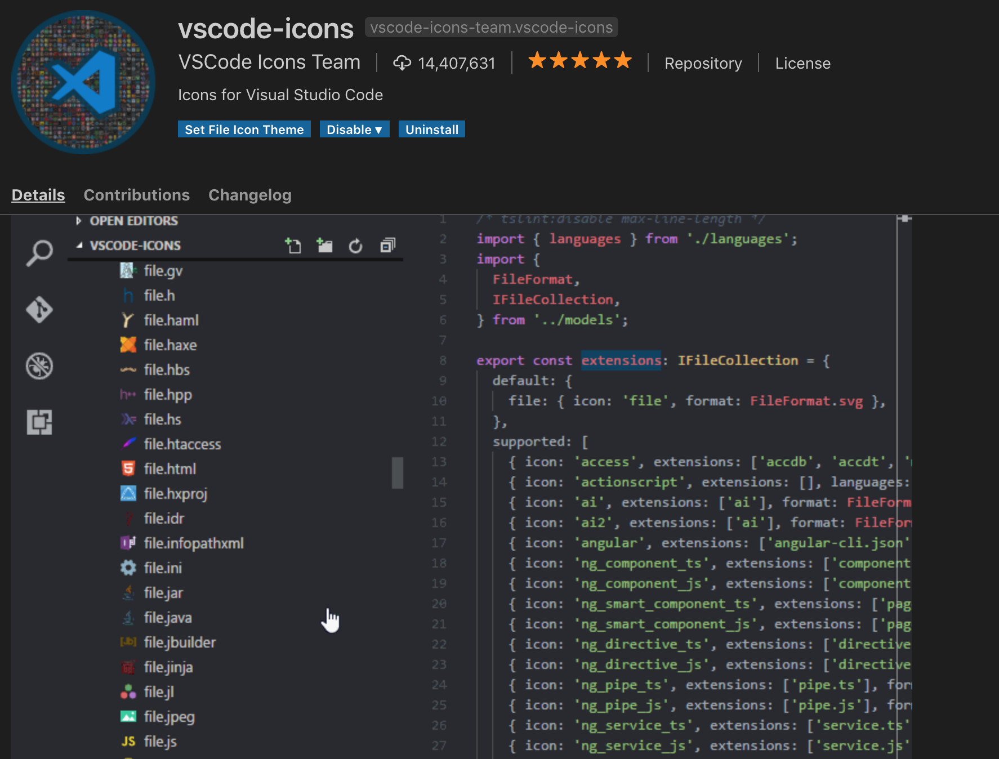

# What is visual studio code?


**Visual Studio Code is a lightweight but powerful source code editor which runs on your desktop and is available for Windows, macOS and Linux. It comes with built-in support for JavaScript, TypeScript and Node.js and has a rich ecosystem of extensions for other languages (such as C++, C#, Java, Python, PHP, Go) and runtimes (such as .NET and Unity). Begin your journey with VS Code with these introductory videos.The last Microsoft Visual Studio is an integrated development environment (IDE) from Microsoft.**

## Three positives
### VS code official document
#### Available across platforms.
>1. Available for macOS, Linux, and Windows.

#### Includes built-in support for IntelliSense code completion.
>2. For serious coding, you'll often benefit from tools with more code understanding than just blocks of text. Visual Studio Code includes built-in support for IntelliSense code completion, rich semantic code understanding and navigation, and code refactoring.

#### Visual Studio Code includes an interactive debugger.
>3. And when the coding gets tough, the tough get debugging. Debugging is often the one feature that developers miss most in a leaner coding experience, so we made it happen. Visual Studio Code includes an interactive debugger, so you can step through source code, inspect variables, view call stacks, and execute commands in the console.

### My opinion

 	- Free
 	- VS code knows me
 	- Extentions
     

### No.1 Reason why you chose this IDE
`Easy to start.`

## Three negatives
1. Too much extentions, and some of them suck.
1. A lot to learn.
1. If you want to compeletily using keyboard to control the command, it might be a little slower.

# Download Visual Studio Code
[download](https://code.visualstudio.com/)

# Visual Studio Code Features
## 1.Keyboard shortcuts
| Shortcut |  Function| 
----|----
| ⌘P   |  Quick Open, Go to File.| 
| ⇧⌘X  | Go to the Extensions view. | 
|⇧⌥A   |Make a comment.|
| ⇧⌥F  |  :heart:Format the entire active file. | 
|⇧⌘P   |  :+1:Super shortcut.| 

### More shortcuts
https://code.visualstudio.com/shortcuts/keyboard-shortcuts-macos.pdf


## 2.languages
## html
_Close tags_
  Tag elements are automatically closed when > of the opening tag is typed.

_Cheat Sheet_

**html:5**
```
<!DOCTYPE html>
<html lang="en">
<head>
<meta charset="UTF-8">
<meta name="viewport" content="width=device-width, initial-scale=1.0">
<meta http-equiv="X-UA-Compatible" content="ie=edge">
<title>Document</title>
</head>
<body>

</body>
</html>
```


**div.navbar**
`<div class="navbar">`


**div>ul>li**
```
<div>
  <ul>
    <li></li>
  </ul>
</div>
```

**ul>li*5**
````
<ul>
  <li></li>
  <li></li>
  <li></li>
  <li></li>
  <li></li>
</ul>
````
**p>a{google}**
`<p><a href="">google</a></p>`

**div>p+p+p**
~~~~
<div>
  <p></p>
  <p></p>
  <p></p>
</div>
~~~~

## css
**p 10px**
```css
{
    padding: 10px;
}
```

**mb1r**
```css
{
    margin-bottom: 1rem;
}
```
**bgcolor:red**
```css
{
    background-color: red;
}
```

## color
1. _Color picker_
The VS Code color picker UI is now available in HTML style sections.


## 

#Git
With Visual Studio Code, you can stay in the same editor you write your code in and work with Git as well. VS Code has the ability to track file changes, make commit, push to central repositories, and more!


# Extensions


1. Markdown Preview Enhanced
Markdown Preview Enhanced ported to vscode.


1. Preview on Web Server
Preview Web Page on Web Server.


 
1. vscode-icons
Icons for Visual Studio Code.



1. indent-rainbow
Makes indentation easier to read.


1. Git History 
View git log, file history, compare branches or commits.


## What do you think of VS Code?

 - [x] Awesome
  - [x] ok
  - [ ] Not for me
